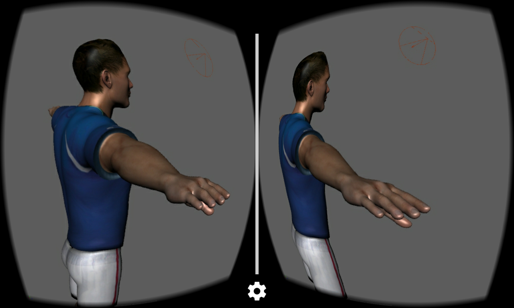

MayaCardboard
=============

Explore a Maya scene using Google Cardboard. Linux and Windows, Maya 2016.

This project has two parts: a Maya plugin and an Android client. The Maya
plugin uses `libusb` to connect to an Android device in accessory mode. It
compresses the contents of a stereo viewport using `libjpeg-turbo` and then
streams the frames over USB to the Android device.
The Android client receives the MJPEG stream from the Maya plugin and displays
the stream using the Google Cardboard SDK.

Using Google Cardboard, the phone sends head-tracking data back to the host
computer so that the stereo camera rig in Maya rotates with your head position,
enabling you to look around the scene.

If you're using Linux, you should be able to acquire `libusb`,
`libjpeg-turbo`, and the Boost headers from the package manager of your Linux
distribution. For reference, I used Fedora 23.

If you're on Windows, you can acquire Boost from NuGet. I have prepackaged
binaries and headers for `libusb` (1.0.20) and `libjpeg-turbo` (1.4.2) for
Visual Studio users.

### Library licenses ###
- [libusb](https://github.com/libusb/libusb) is licensed under the LGPL.
- [libjpeg-turbo](https://github.com/libjpeg-turbo/libjpeg-turbo) is licensed
  under the IJG, BSD, and zlib licenses.

Maya plugin (`MayaUsbStreamer`)
-------------------------------
The Maya plugin exposes three commands, `usbConnect`, `usbStatus`, and
`usbDisconnect`.
- `usbConnect`: this command requires three parameters, `-id`, `-sp`, and `-h`.
  The `-id` parameter must be two strings, representing the USB VID and PID of
  a connected Android device in hex format, e.g. `-id "18d1" "4ee2"` for a
  Google Nexus 4. The `-sp` parameter is the name of a stereo panel, e.g.
  `-sp StereoPanel` for the default stereo panel. The `-h` parameter is the
  name of the scene object that acts as the head, e.g. `-h stereoCamera` to
  track the rotation of the stereo camera rig.
  - Example command: `usbConnect -id "22b8" "2e82" -sp StereoPanel
    -h stereoCamera`
- `usbStatus`: returns information about the currently-connected USB device.
- `usbDisconnect`: stops the stream if a USB device is connected.

The stereo panel that you use for the `-sp` parameter must be set to
"checkerboard" stereo output. The plugin will take the checkerboard-formatted
image and reconstitute separate left and right images. It then combines the
two left and right images side-by-side into one single frame to send to the
Android device.

### Linux setup ###
You must edit your `udev` rules to allow your device's VID/PID, as well as
allowing all devices with VID `18d1` (Google's VID), which is used when the
device is in accessory mode. Use `lsusb` to determine your device's VID/PID.

### Windows setup ###
You must copy the DLLs in the `MayaUsbStreamer/dll` folder into Maya's
installation directory or a directory on your `PATH`. I personally have created
an `ExtraDlls` folder on my hard disk that I have added to my `PATH`, and I
placed the required DLLs there.

You must also install WinUSB drivers for your phone. I recommend using
[Zadig](http://zadig.akeo.ie/) to install the drivers. Note that the streaming
plugin will switch your phone to Android accessory mode, which changes the
phone's VID/PID, making Windows think it's a different device. Thus, you need
to run Zadig twice. Run it initially once. Then try to connect to the phone
using the streaming plugin; the phone will switch to accessory mode but the
connection will fail. You then need to run Zadig again on the phone in
accessory mode. You only need to go through this procedure the first time;
Windows will load the right drivers afterwards.

### Streaming details! ###
When the plugin receives the device's handshake, it begins a send loop on a
separate thread. The send loop sleeps until Maya reports that the viewport
has redrawn. At that point, the frame is queued, and a monitor is used to
notify and wake up the send loop thread. The send loop then compresses the
frame into a JPEG and performs a USB bulk transfer (note that isochronous
transfers are not available over Android accessory protocol). If the send loop
is busy when another frame is queued, that frame will be discarded.

Android client (`MayaUsbReceiver`)
----------------------------------
This is an Android app that requires OpenGL ES 2. To connect with Maya, first
send the `usbConnect` command from Maya, then click the "Send Handshake" button
in the client. If all goes well, the Maya plugin will begin streaming.

The Android client receives frames with the left-eye image on the left half and
the right-eye image on the right half. It draws this in OpenGL using a quad
that displays the left half of the render texture for the left eye and vice
versa for the right eye.

The client also continually sends back head-tracking data provided by the
Cardboard SDK. When the host computer receives the head-tracking data, it
adjusts the stereo camera rig to match.

Troubleshooting
---------------
- If the connection drops, check the Maya Output Window for the error details.
  If the error indicates something like `Status in beginReadLoop=-1`, this
  means that the physical USB connection failed, probably due to a plug being
  loose.

TODOS
-----
- The render size is currently hardcoded in the plugin as 1280x720, which
  generates a 640x720 image for each eye. (Note that the plugin will ask Maya
  to render viewports at _1280x1440_ in order to produce the correct per-eye
  aspect ratio.)
- The stereoscopic camera is not setup using the Cardboard viewer parameters.
